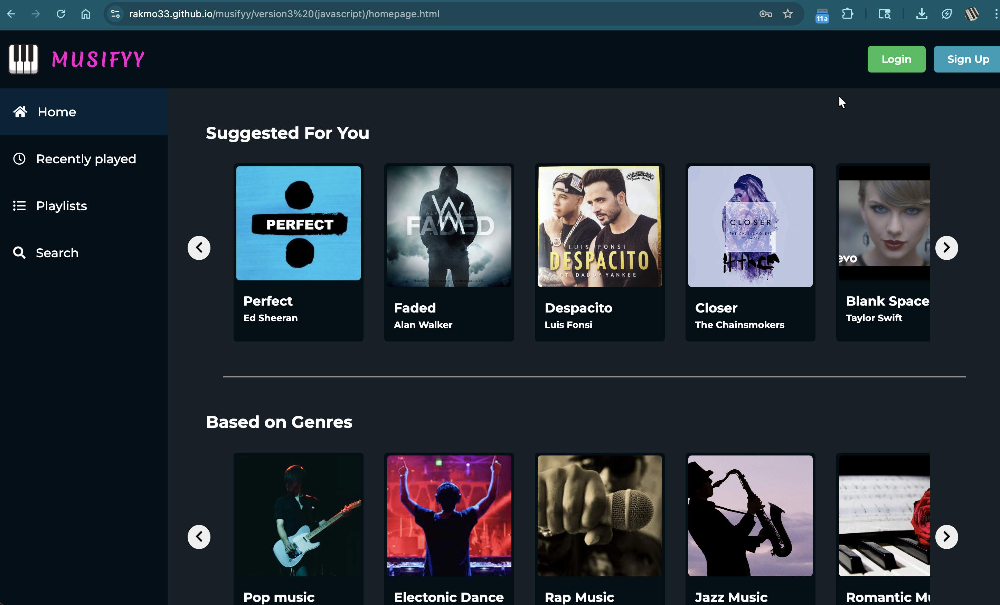
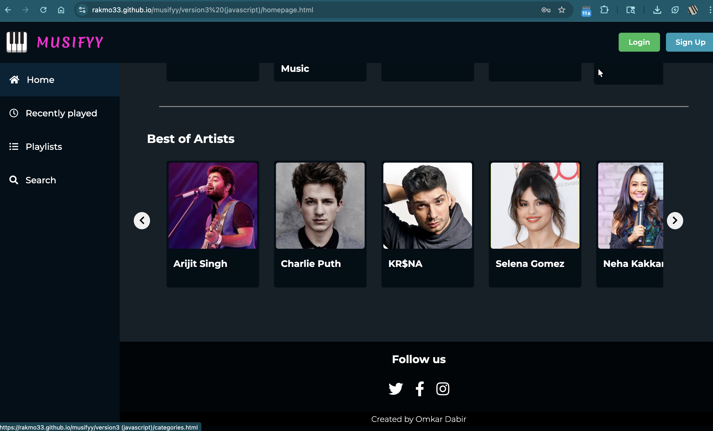
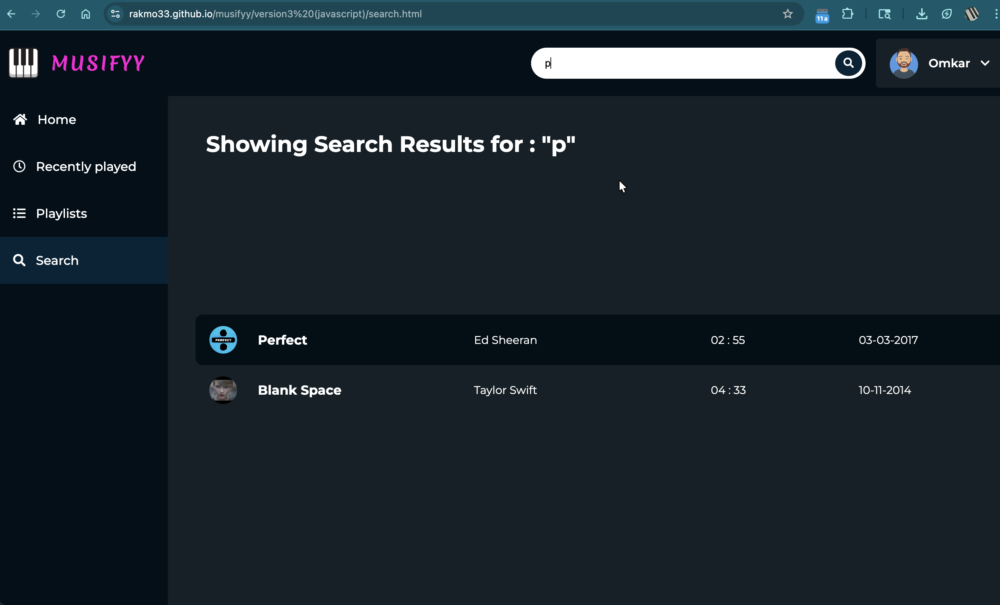
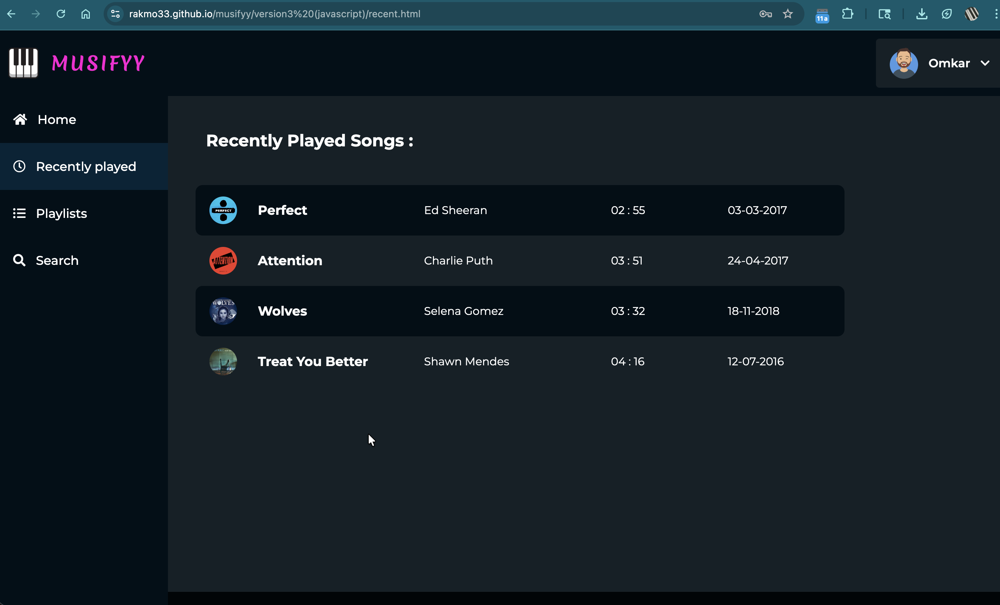
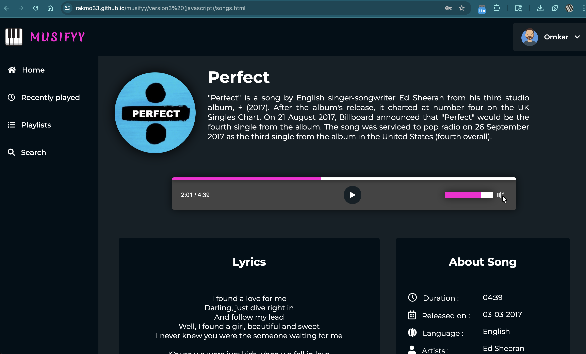
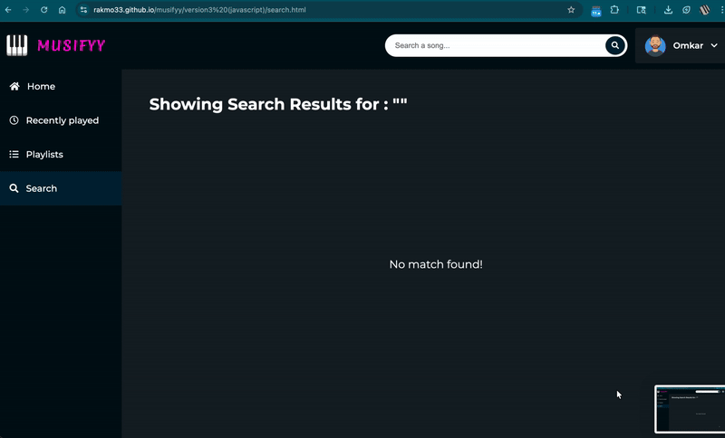

# 🎧 Musifyy  
*A modern Spotify-inspired music streaming UI*

Musifyy is a **frontend-only Spotify UI clone** built to showcase **UI craftsmanship, smooth interactions, and custom audio controls**.  
The project focuses purely on **design, responsiveness, and user experience**, without any backend or real streaming APIs.

---

## 🌐 Live Demo

🚀 Experience Musifyy live:  
[Demo 🔗](rakmo33.github.io/Musifyy-Spotify-Clone/version3%20(javascript)/welcome.html)

---

## ✨ Highlights

- 🎨 **Beautiful, modern UI** inspired by Spotify  
- 🎠 **Coustom carousels** for playlists & albums  
- 🎵 **Custom music player** with full controls  
- 🔐 **Authentication validation UI** (Login / Signup)  
- 🔍 **Search for songs** quickly and intuitively  

---

## 🛠️ Tech Stack

- HTML
- CSS
- JavaScript

> This project intentionally avoids backend integration to keep the focus on **frontend quality and UX polish**.

---

## 🖼️ Screenshots (Placeholders)
Login Page 
  

Landing Page
  
  

Search
  

Playlists
  

Music Player
  

---

## 🎬 Demo GIFs (Recommended)

**Authentication UI Flow**  
  

**Playlist Carousel**  
  

**Music Player Interaction**  
  

---

## ⭐ Acknowledgements

Inspired by Spotify’s design language.  
Built purely for **learning, experimentation, and UI showcase**.
